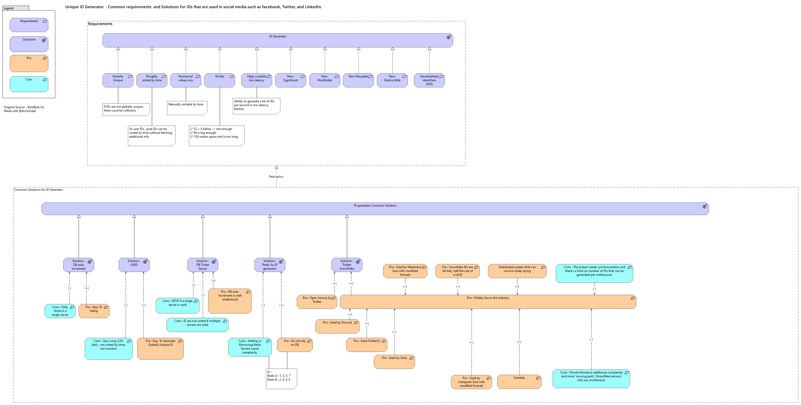
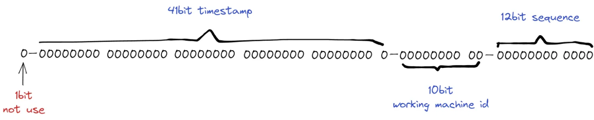

# IDs...YOu have the choice



# snowflake1

Snowflake is a network service for generating unique ID numbers at high scale with some simple guarantees.

The ID generated by the snowflake algorithm is not guaranteed to be unique. For example, when two different requests enter the same machine at the same time, and the sequence generated by the node is the same, the generated ID will be duplicated.

So if you want use the snowflake algorithm to generate unique ID, You must ensure: The sequence-number generated in the same millisecond of the same node is unique.

- The first bit is unused sign bit.

- The second part consists of a 41-bit timestamp (milliseconds) whose value is the offset of the current time relative to a certain time.

- The third part consist of 10 bits machineID(5 bit workid + 5 bit datacenter id), max value is 2^10 -1 = 1023.

- The fourth and last part consists of 12 bits, its means the length of the serial number generated per millisecond per working node, a maximum of 2^12 -1 = 4095 IDs can be generated in the same millisecond.The binary length of 41 bits is at most 2^41 -1 millisecond = 69 years. So the snowflake algorithm can be used for up to 69 years, In order to maximize the use of the algorithm, you should specify a start time for it.

The ID generated by the snowflake algorithm is not guaranteed to be unique. For example, when two different requests enter the same machine at the same time, and the sequence generated by the node is the same, the generated ID will be duplicated.

So if you want use the snowflake algorithm to generate unique ID, You must ensure: The sequence-number generated in the same millisecond of the same node is unique.

La mantisse snowflake :


et l'utilisation par Discord :


## Getting started

To make it easy for you to get started with GitLab, here's a list of recommended next steps.

Already a pro? Just edit this README.md and make it your own. Want to make it easy? [Use the template at the bottom](#editing-this-readme)!

## Add your files

- [ ] [Create](https://docs.gitlab.com/ee/user/project/repository/web_editor.html#create-a-file) or [upload](https://docs.gitlab.com/ee/user/project/repository/web_editor.html#upload-a-file) files
- [ ] [Add files using the command line](https://docs.gitlab.com/ee/gitlab-basics/add-file.html#add-a-file-using-the-command-line) or push an existing Git repository with the following command:

```
cd existing_repo
git remote add origin https://oogit.oodrive.net/architecture/snowflake1.git
git branch -M main
git push -uf origin main
```

## Integrate with your tools

- [ ] [Set up project integrations](https://oogit.oodrive.net/architecture/snowflake1/-/settings/integrations)

## Collaborate with your team

- [ ] [Invite team members and collaborators](https://docs.gitlab.com/ee/user/project/members/)
- [ ] [Create a new merge request](https://docs.gitlab.com/ee/user/project/merge_requests/creating_merge_requests.html)
- [ ] [Automatically close issues from merge requests](https://docs.gitlab.com/ee/user/project/issues/managing_issues.html#closing-issues-automatically)
- [ ] [Enable merge request approvals](https://docs.gitlab.com/ee/user/project/merge_requests/approvals/)
- [ ] [Set auto-merge](https://docs.gitlab.com/ee/user/project/merge_requests/merge_when_pipeline_succeeds.html)

## Test and Deploy

Use the built-in continuous integration in GitLab.

- [ ] [Get started with GitLab CI/CD](https://docs.gitlab.com/ee/ci/quick_start/index.html)
- [ ] [Analyze your code for known vulnerabilities with Static Application Security Testing(SAST)](https://docs.gitlab.com/ee/user/application_security/sast/)
- [ ] [Deploy to Kubernetes, Amazon EC2, or Amazon ECS using Auto Deploy](https://docs.gitlab.com/ee/topics/autodevops/requirements.html)
- [ ] [Use pull-based deployments for improved Kubernetes management](https://docs.gitlab.com/ee/user/clusters/agent/)
- [ ] [Set up protected environments](https://docs.gitlab.com/ee/ci/environments/protected_environments.html)

***

